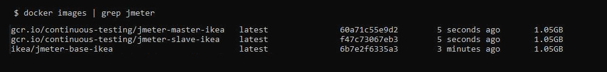
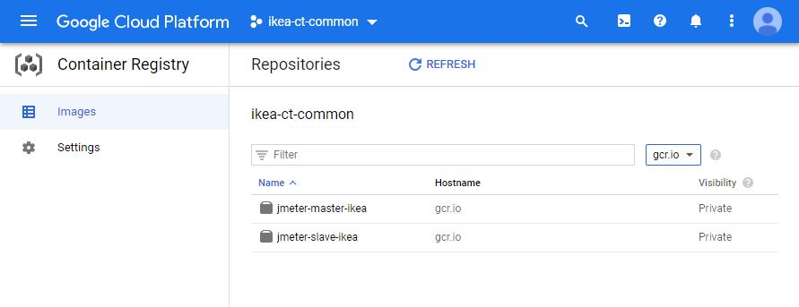

# Docker images
<br />

NOTE: Some information is from IKEA, please disregard from the information regarding this!

## Information and content
<br />
## Build JMeter Docker images
To be able to run JMeter or your apllication in GCP and in Google Kubernetes engine we need to build and push Docker images to a GCP registry.<br />
Please add the components needed [see base image](./Dockerfile-base-centos) for your test (e.g, plugins, backendlisteners and test artifacts)<br />
Centos image is used in this demo.<br />

```
./create_images.sh
```
NOTE: You need to have set your GCP $PROJECT_ID as environment variable<br />
PS: Go and grab a cop of coffe while the Base image is building <br />
Check that your images has been built:<br /><br />

<br />

## Push Docker images
We need to authenticate to GCP by running gcloud command:
```
gcloud auth configure-docker
```
Use the attached script 
```
./push_images.sh
```
or simple run it manually from shell (Use Powershell if Bash doesn't work)<br />
```
docker push gcr.io/${PROJECT_ID}/jmeter-master-ikea:latest
docker push gcr.io/${PROJECT_ID}/jmeter-slave-ikea:latest
```
Login to Google cloud and control your images has been correctly uploaded: <br /><br />


## Build InfluxDB and Grafana Docker images

In this demo InflucDB latest image and Grafana 7.2.0 official images been used. Please pull the images, re-tag them and push them to GCP registry.<br />
example given
```yaml
#!/bin/bash
docker pull grafana/grafana:7.2.0
docker tag grafana/grafana:7.2.0 gcr.io/continuous-testing/grafana:7.2.0
docker pull influxdb:latest
docker tag influxdb:latest gcr.io/continuous-testing/influxdb:latest
#E.g PROJECT_ID=continuous-testing
docker push gcr.io/continuous-testing/grafana:7.2.0
docker push gcr.io/continuous-testing/influxdb:latest
```
Files: <br />
- __create_images.sh__ : *Example script to create images*
- __push_images.sh__ : *Example script to crepushate images*
- __retag_images.sh__ : *Example script to re-tag images*
- __Dockerfile-base-centos__ : *JMeter Centos7 image*
- __Dockerfile-base-ubuntu__ : *JMeter Ubuntu image*
- __Dockerfile-master__ : *JMeter master image*
- __Dockerfile-slave__ : *JMeter slave image*
