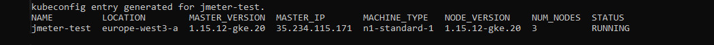
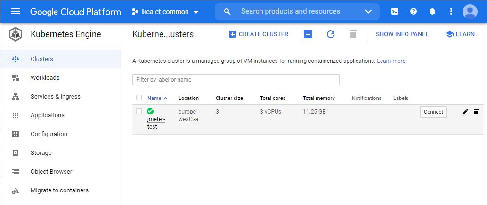
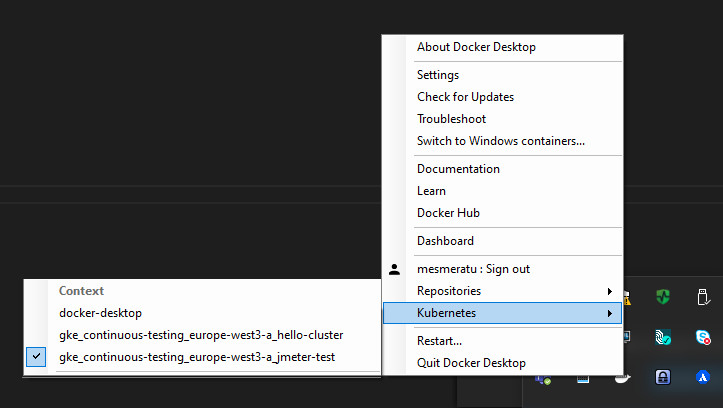

# jmeter-distibuted-Kubernetes
<br />

NOTE: Some information is from IKEA and GKE setup, please disregard from this information!<br />

Repository for running JMeter distributed testing in GCP (GKE) (Windows 10 + Ubuntu WDL)<br />
The main use for this project is to scale basic performance tests which use HTTP(s) and rest API calls.
## Run from repository
### Requirements:
- Local installation of Docker and Kubernetes support (kubectl)<br />
- (Optional) Google GCP Account with correct permissions<br /><br />

Tested with Windows Docker 19.03.8 and Ubuntu LTS 18.04 (Windows subssystem WSL)<br />

## Quick Setup
This part is intended to explain how to setup and execute tests, for in depth information, please read the Technical information.<br /> 
Pre-requisites for Google GKE:<br />
Linux Bash, GKE cluster and Google SDK installed locally (You can run it locally)<br />
Push images to GCP registry for JMeter, InfluxDB and Grafana, see [Docker folder](./Docker/)

- Run (from /jmeter-distributed-kubernetes/kubernetes)
```yaml 
./create_environment.sh
```
This script will deploy the jmeter setup (numer of slaves (2) is defined in jmeter_slaves_deploy.yaml as replicas ) and you need to give a unique name for the namespac. It will deply environment variables from *variables.env* and CSV data from *test.csv*.<br />
- Run (from /jmeter-distributed-kubernetes/kubernetes/monitor)
```yaml 
./setup_environment.sh
```
This script will deploy influxDB (together with setting) and Grafans in default namespace. IT will create a persistent storage for jmeter DB in default namespace- <br />
```yaml 
./setup_dashboard.sh
```
This script will create a JMeter influx DB, setup a datasource in Grafana and deploy ecample dashboard (jmeter_load_test.json).
- Run test (from /jmeter-distributed-kubernetes/kubernetes)
```yaml 
./run_test.sh <name of your JMX test script>

e.g ./run_test.sh wikipedia_bl.jmx
```
A test with additional mandatory settings for components (Backendlistener) will be executed and monitored in the Grafana dahboard. A report is created in the repository after execution.<br /><br />

## Technical information

### Setup environment

To be able to use GCP and GKE in your local environment an installation locally of the Google cloud SDK.<br /><br />
Install the [Google Cloud SDK](https://cloud.google.com/sdk/docs/install), which includes the gcloud command-line tool.<br />
Using the gcloud command line tool, install the Kubernetes command-line tool. kubectl is used to communicate with Kubernetes, which is the cluster orchestration system of GKE clusters:
```yaml 
gcloud components install kubectl
```
Install Docker Community Edition (CE) on your workstation ([Docker for Windows](https://docs.docker.com/docker-for-windows/install/)). You will use this to build a container image for the application.

### Environment variables

In GCP we need to use a couple of parameters to communicate and set basic properties<br />
Those parameters can be good to set as environment variables (Linux):<br />
```yaml
export PROJECT_ID=<your GCP project ID>
export COMPUTE_ZONE=europe-west3-a
```
Set your parameters in GCP:
```yaml
gcloud config set project $PROJECT_ID
gcloud config set compute/zone $COMPUTE_ZONE
```
### Prepare for deployment
#### Build and push Docker iamges
To be able to run JMeter or your apllication in GCP and in Google Kubernetes engine we need to build and push Docker imagesto a GCP registry.<br />
Please goto your local [Docker folder](./Docker/) for further instructions and to Build locally and push to GCP registry:
### Setup GKE cluster
If you have set your environment variables correctly like 
```
gcloud config set project $PROJECT_ID
gcloud config set compute/zone $COMPUTE_ZONE
```
You should be ready for creating the GKE cluster which we will use for running performance test.<br />
Create your cluster with following command and a GKE cluster name jmeter-test shall be created:
```yaml
gcloud container clusters create jmeter-test
```
Output like below should be seen when cluster is generated:<br />
<br /><br />
Verify your cluster in GCP:<br /><br />
<br />
IMPORTANT: YOU NEED TO SET THE CORRECT KUBERNETES ENGINE!!! ESPECIALLY IF RUNNING K8 LOCALLY -
```
kubectl.exe config get-contexts
```
You can set GKE to your contect by using Docker for windows<br /><br />
<br />

IMPORTANT 2 : IF YOU HAVE CREATED A CLUSTER AND REMOVED IT - IT MIGHT BE NECESSARY TO RUN -
```
gcloud container clusters get-credentials jmeter-test --zone $COMPUTE_ZONE --project $PROJECT_ID
```
Some problems might appear in LINUX WDL environment, please try to run it in Powershell with - e.g.<br />
(gcloud container clusters get-credentials jmeter-test --zone europe-west3-a --project continuous-testing)<br />
Otherwise you might run into certificate issues (Unable to connect to the server: x509: certificate signed by unknown authority)

### Setup and Run tests

We will run the tests in GKE by running a script deploying containers and creating environment.
Please goto [Kubernetes folder](./kubernetes/) for more information
