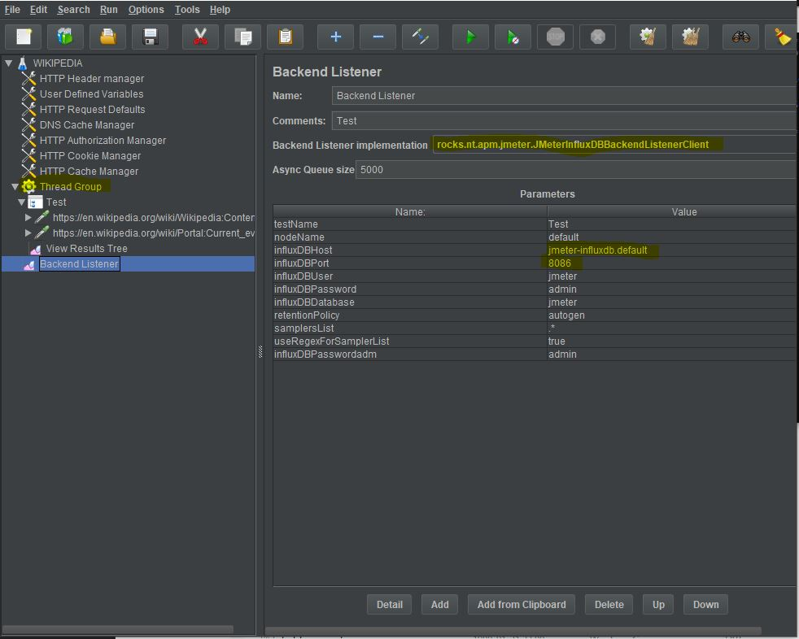

# Script for running in Kubernetes 
<br />

NOTE: Some information is from IKEA, please disregard from the information regarding this!

This folder contains script for setting up JMeter instances and execute performance test with JMeter.<br />
Before running the scripts please assure you have a cluster setup in GCP (GKE).

## Setup
### Creating Namespace
To be able to run and organize JMeter docker instances we will create a namespace in the cluster where we deploy the containers. This is not necessary, but it is easier to organize the docker containers. The script provided is creating a nampespace. If having communication to other applications under test, please consider where to run the images.<br /> 

### Deploy containers
Run: <br />
```
./create_environment.sh
```
and provide a name of your namespace.<br />

A dynamic configmap is creted during runtime to deploy environment variables to PODS.<br /> 
Create namespace manually:<br /> 
```
kubectl.exe create namespace <namespace_name>;
```
Delete namespace:<br /> 
```
kubectl.exe delete namespace <namespace_name>;
```

### Re-deploy 
E.g. If pdating variables config map and you need to re-deploy
```
kubectl.exe create configmap -n $tenant env-variables --from-env-file=./variables.env -o yaml --dry-run | kubectl.exe replace -f -

kubectl.exe -n $tenant rollout restart deployment jmeter-master
kubectl.exe -n $tenant rollout restart deployment jmeter-slaves
```
If scaling up the number of slaves it is possible to run:
```
kubectl.exe -n $tenant scale deployment jmeter-slaves --replicas=<number of replicase>
```
## Run performance test
The easiest way to run the performance test is to run the script provided. It can be run as:
```
./run_test.sh <your jmx-file>
```
This is a basic test with no attached test artifacts or any parameter file.<br />
It will copy an HTML report back to your repository<br />
A backendlistener is added for viewing and monitor test in Grafana.<br />


There is a couple of different approaches to use test artifacts:<br />
* Attach the artifacts during the building of the images (Need to deply the image to registry) 
* Mount and share you local filesystem with test artifacts
* Create a shared volume in Kubernetes with test artifacts

NOTE: Number of threads will be multiplied by numbers of replicas.

## Settings of performance test
The tests in recorded by blazemeter Chrome plugin and is a simple web based scenarion.<br />
A Backendlistener is added to the test<br />
Configuration of BackendListener:<br /><br />
<br /><br />
Important settings:<br />
InfluxDBHost: should be name of pod with a dot-extensin of K8 namespace<br />
InfluxDBPort: 8086<br />
Thread Group: Set the number of virtual users and run parameters.<br />
Backend Listener: Name of the backend Listener used<br /><br />

## Delete environment
Clean up and delete the JMeter namespace

```
kubectl.exe delete namespace <name of your namespace>
```
Delete the GKE cluster<br />
NOTE: If you have created a persistent storage in the cluster this will remove the data!
```
gcloud container clusters delete <name of your cluster>
```

## File list 
Folders: <br />
- __admin__ : *Setup for local dashboard*
- __monitor__ : *Setup for influxDB and Grafana* <br />
Files: <br />
- __create_environment.sh__ : *Script to setup JMeter master and slaves*
- __run_test.sh__ : *Script for running test*
- __stop_test.sh__ : *Script for (force) stop test*
- __jmeter_master_configmap.yaml__ : *Script for creating test parmaeters and script*
- __jmeter_master_deploy.yaml__ : *Deploy JMeter master*
- __jmeter_slave_deploy.yaml__ : *Deploy JMeter slaves (number of replicas set the amount of LG:s)*
- __jmeter_slave_svc.yaml__ : *Start jmeter slaves as services*
- __test.csv__ : *Example of CSV file configuration*
- __variables.env__ : *Environment variables for all pods*
- __wikipedia_bl.jmx__ : *JMeter test of wikipedia with plugins and jmeter-influxDB-writer (rocks.nt.apm.jmeter.JMeterInfluxDBBackendListenerClient)*
- __wikipedia_bl2.jmx__ : *JMeter test of wikipedia with plugins and jmeter standard BL.listener (cloud.testload.jmeter.InfluxDBBackendListenerClient)*