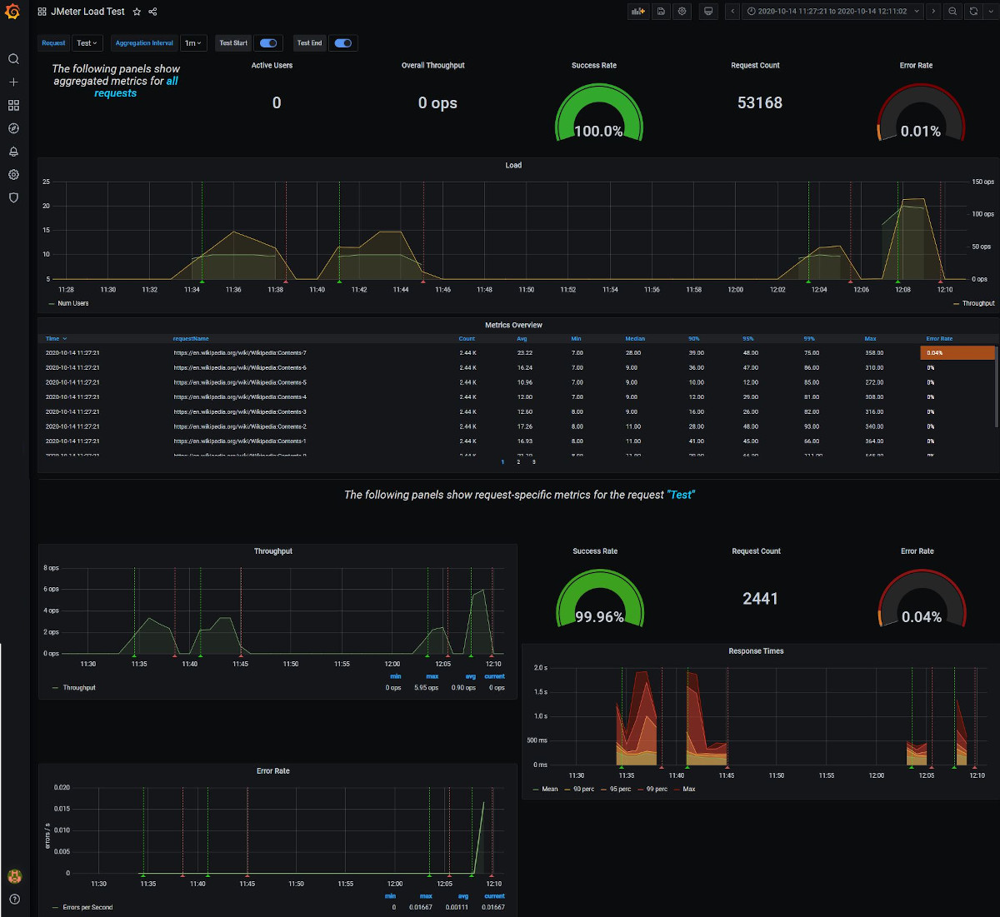
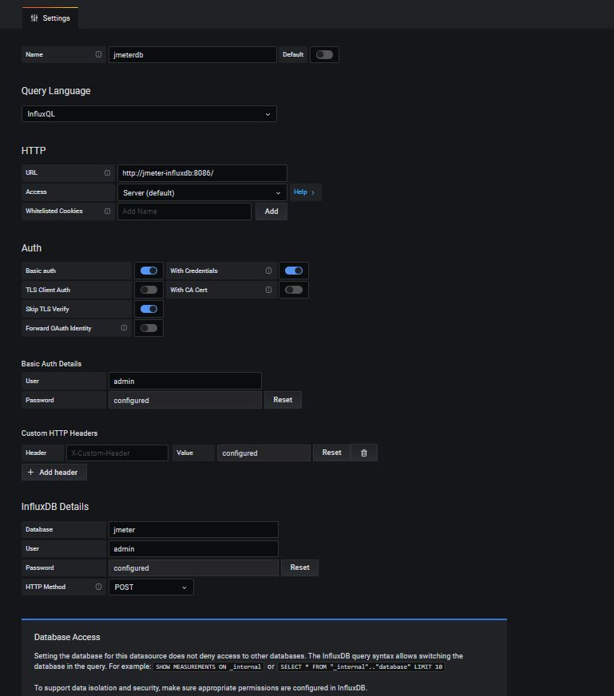

# Setup of environment

The setup is deployd into the default namesopace instead of the newly created namespace with JMeter. The reason is we are creating a persistent storage in the default names and it is also much easier to remove the namespace with JMeter without any need of removing the monitoring pods. 

## InfluxDB setup
We are creating a persistent storage where we create the JMeter influx DB database(jmeter_influxdb_volumeclaim.yaml). All setting for the communication and setup for influx is deployed by the configmap (jmeter_influxdb_configmap.yaml). We will deploy the influxDB pod and start it as a service  
In the setup of dashboard script we will create the database
## Grafana setup
We deploy Grafana as pod and start the service by the YAML-files. 
In the setup dashboard we are creating datasource for the influxDB and deploing an example dashboard (jmeter_load_test.json). 
The address to grafana is provided by the script. Login is the default values admin/admin which is recommended to change.  
Dashboard : 
  
Datasource : 
 

## File list 
Files:  
- __setup_environment.sh__ : *Script to setup InfluxDB and Grafana*
- __setup_dashboard.sh__ : *Script to setup database in InfluxDB and datasource/dashboard in Grafana*
- __jmeter_grafana_deploy.yaml__ : *Deploy Grafana*
- __jmeter_grafana_svc.yaml__ : *Start Grafana as services*
- __jmeter_influxdb_configmap.yaml__ : *Script for creating setting in influxDB*
- __jmeter_influxdb_volumeclaim.yaml__ : *Create persistent volume for JMeter DB*
- __jmeter_influxdb_deploy.yaml__ : *Deploy InfluxDB pod*
- __jmeter_influxdb_svc.yaml__ : *Start InfluxDB as service*
- __jmeter_load_test.json__ : *Example of Grafana dashboard json configuration and setup*